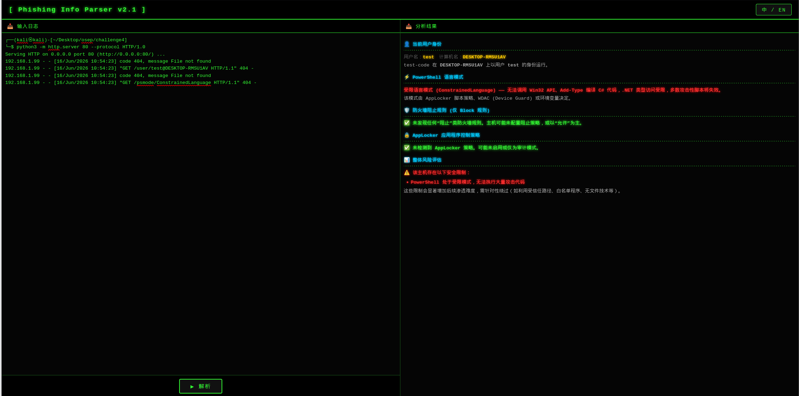
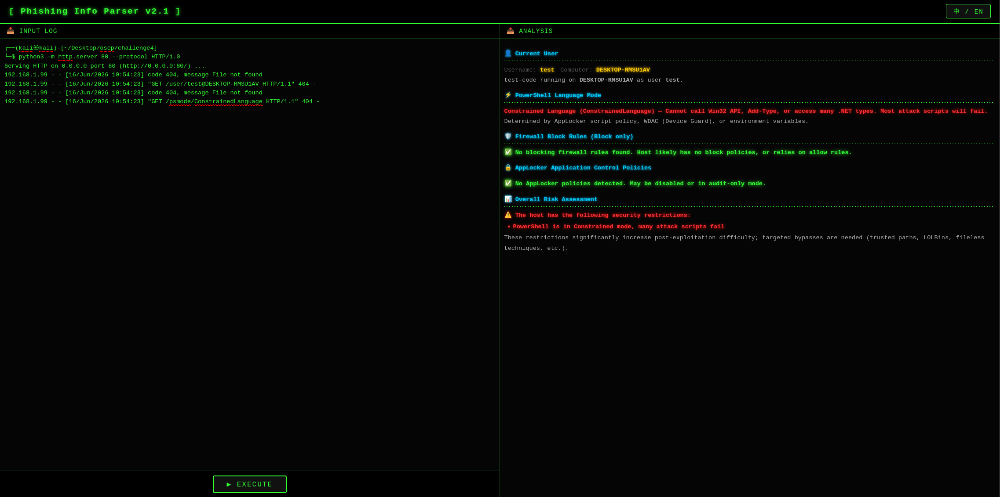

## PhishingInfoParser

一套用于在钓鱼测试中收集目标主机安全配置信息的工具链，包含钓鱼载荷（HTA / VBA 宏）及离线日志解析器。

## ⚠️免责声明

**本工具仅供安全研究与授权测试使用。使用者须遵守所在国法律法规，并确保已获得被测系统所有者的明确授权。严禁将此工具用于任何非法攻击、入侵或破坏他人计算机系统的活动。若使用者违反前述规定，产生的一切法律责任与后果由使用者自行承担，与本项目及开发者无关。**

### 📁 文件说明

| 文件 | 用途                                                                          |
| ------ | ------------------------------------------------------------------------------- |
| `info.hta`     | HTA 钓鱼载荷，点击链接即执行，收集主机信息并以带前缀的 HTTP GET 请求回传 C2   |
| `info.vba`     | Office 宏钓鱼载荷，嵌入 Word/Excel 文档，启用宏后自动收集信息并回传           |
| `PhishingInfoParser.html`     | 离线日志解析器，将 C2 监听到的请求日志粘贴进来，自动翻译成结构化中文/英文报告 |

### 🧬 收集的信息

两个载荷均能收集以下主机情报（所有结果通过 HTTP GET 发送至 C2，路径带固定前缀）：

- **用户身份** → `/user/<UserName@ComputerName>`
- **PowerShell 语言模式** → `/psmode/<LanguageMode>`
- **防火墙阻止规则** → `/fwblock/<RuleDisplayName>`（多条）
- **AppLocker 策略** → `/applocker/<RuleCollectionName>`（多条）

### 🚀 快速开始

1. **准备 C2 监听**
   在内网一台可被目标访问的机器上启动 HTTP 服务（仅需记录请求）：

   ```bash
   python3 -m http.server 80 --protocol HTTP/1.0
   ```

   或使用 `nc -lvp 80`。
2. **配置载荷**
   打开 `info.hta` 和 `info.vba`，将开头的 `C2` 变量或 `C2` 常量修改为你的监听地址，例如：
   javascript

   ```
   var C2 = "http://192.168.45.220";
   ```

   vb

   ```
   C2 = "http://192.168.45.220"
   ```
3. **投递载荷**

   - **HTA**：将 `info.hta` 托管在 Web 服务器上，向目标发送链接，诱导其点击“打开”。
   - **宏**：将 `info.vba` 嵌入 Office 文档，通过邮件等方式发送，诱使受害者启用宏。
4. **解析结果**
   将 C2 服务器上记录的 `GET` 请求日志（如 `"GET /user/... HTTP/1.1" 404 -`）全部复制，粘贴到 `PhishingInfoParser.html` 的左侧文本框，点击  **▶ EXECUTE**，右侧即显示详细分析（支持中英文切换）。
   也可以直接用：https://rasalghul-1.github.io/MirageShell/PhishingInfoParser.html

### 📊 解析器输出示例

```text
# 中文

👤 当前用户身份
用户名：test　计算机名：DESKTOP-RMSU1AV
test-code 在 DESKTOP-RMSU1AV 上以用户 test 的身份运行。
⚡ PowerShell 语言模式
受限语言模式 (ConstrainedLanguage) —— 无法调用 Win32 API、Add-Type 编译 C# 代码，.NET 类型访问受限，多数攻击性脚本将失效。
该模式由 AppLocker 脚本策略、WDAC (Device Guard) 或环境变量决定。
🛡️ 防火墙阻止规则 (仅 Block 规则)
✅ 未发现任何“阻止”类防火墙规则。主机可能未配置阻止策略，或以“允许”为主。
🔒 AppLocker 应用程序控制策略
✅ 未检测到 AppLocker 策略。可能未启用或仅为审计模式。
📊 整体风险评估
⚠️ 该主机存在以下安全限制：
    PowerShell 处于受限模式，无法执行大量攻击代码
这些限制会显著增加后续渗透难度，需针对性绕过（如利用受信任路径、白名单程序、无文件技术等）。


# English
👤 Current User
Username: test　Computer: DESKTOP-RMSU1AV
test-code running on DESKTOP-RMSU1AV as user test.
⚡ PowerShell Language Mode
Constrained Language (ConstrainedLanguage) — Cannot call Win32 API, Add-Type, or access many .NET types. Most attack scripts will fail.
Determined by AppLocker script policy, WDAC (Device Guard), or environment variables.
🛡️ Firewall Block Rules (Block only)
✅ No blocking firewall rules found. Host likely has no block policies, or relies on allow rules.
🔒 AppLocker Application Control Policies
✅ No AppLocker policies detected. May be disabled or in audit-only mode.
📊 Overall Risk Assessment
⚠️ The host has the following security restrictions:
    PowerShell is in Constrained mode, many attack scripts fail
These restrictions significantly increase post-exploitation difficulty; targeted bypasses are needed (trusted paths, LOLBins, fileless techniques, etc.).
```





### ⚙️ 技术细节

- 所有载荷均避免使用可能被受限语言模式（CLM）禁用的 .NET 方法，仅使用基础的 `whoami`、`Get-NetFirewallRule`、`Get-AppLockerPolicy` 等 cmdlet，最大限度保证在受控环境中的执行成功率。
- HTTP 请求中空格被替换为 `+`，特殊字符经 `encodeURIComponent` 编码，解析器会自动解码。
- Python `http.server` 偶尔出现的 `ConnectionResetError` 是客户端提前关闭连接所致，不影响数据收集，可忽略或使用 `nc` 监听消除。
