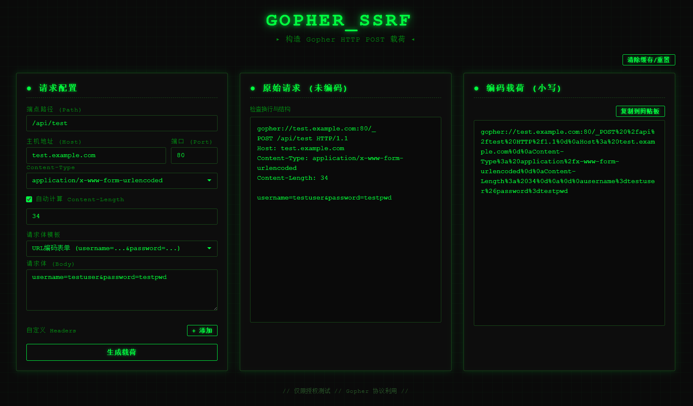

# Gopher-POST

# Gopher SSRF POST载荷生成器

> 一款运行在浏览器中的工具，用于快速构造、预览和编码 Gopher 协议的 HTTP POST 载荷，辅助 SSRF 安全测试。

---

## 功能特点

- **三列可视化面板**：配置区、原始请求预览区、编码后载荷输出区，一目了然。
- **完整 HTTP 请求构造**：支持自定义端点、Host、端口、Content-Type、请求体以及任意自定义 Header。
- **常见 Content-Type 下拉选择**：内置 `application/x-www-form-urlencoded`​、`application/json`​、`text/xml` 等，也可手动输入自定义类型。
- **请求体模板快速填充**：一键切换 URL 编码表单、JSON 登录、XML 登录等常见模板，Content-Type 自动跟随切换。
- **自动计算 Content-Length**：根据请求体字节数实时计算，也可以手动指定。
- **Host 头智能处理**：分离主机与端口输入，默认 80/443 端口自动省略端口号，符合 HTTP 标准。
- **标准 Gopher 编码**：对整个 HTTP 请求进行 `\r\n` 保留和 URL 编码，十六进制字母强制小写以增强兼容性。
- **一键复制**：编码后的完整 `gopher://` 链接可直接复制到剪贴板。
- **配置持久化**：所有输入自动保存到浏览器本地存储，关闭页面或重启浏览器后仍会恢复上次配置。
- **清除缓存/重置**：一键清空所有保存数据并恢复为默认测试值。
- **纯前端零依赖**：单个 HTML 文件即可运行，无需任何服务器或外部资源。

---

## 截图示意

---

## 使用方法

1. **下载/克隆**本仓库的 `gopher-post.html` 文件。也可以直接使用：https://rasalghul-1.github.io/MirageShell/gopher-post.html
2. 用任意现代浏览器打开该 HTML 文件。
3. 在左侧“请求配置”面板填写参数：

   - **端点路径**：如 `/api/login`。
   - **主机地址**：目标主机名，如 `test.example.com`。
   - **端口**：目标端口，默认为 `80`。
   - **Content-Type**：下拉选择或手动输入。
   - **请求体**：直接输入或通过“请求体模板”快速填充。
   - **自定义 Headers**：可添加任意个额外的 HTTP 头。
4. 点击 **生成载荷** 按钮（或任意输入框修改后自动触发）。
5. 中间面板显示未编码的原始 Gopher 请求，用于检查换行与结构是否正确。
6. 右侧面板显示完整编码后的 `gopher://`​ 链接，点击 **复制到剪贴板** 即可在授权测试中使用。

---

## 配置与持久化

- 所有输入项（包括自定义 Header）都会在 **0.5 秒无操作后自动保存**到浏览器的 `localStorage`。
- 重新打开页面时会自动恢复上次的所有配置。
- 如需彻底清除所有保存数据并恢复默认值，点击右上角 **清除缓存/重置** 按钮即可，页面会立即重置并提示。

---

## 默认测试数据

为保护靶场隐私，工具初始默认值均使用无害的测试占位符：

|配置项|默认值|
| --------------| --------|
|端点路径|​`/api/test`|
|主机地址|​`test.example.com`|
|端口|​`80`|
|Content-Type|​`application/x-www-form-urlencoded`|
|请求体|​`username=testuser&password=testpwd`|

请根据你的实际授权测试目标修改这些值。

---

## 注意事项

- 本工具仅用于**合法授权的安全测试**，禁止未授权攻击。
- Gopher 协议在大多数现代浏览器中已被禁用，通常需结合 SSRF 漏洞利用。
- 生成的载荷需结合具体 SSRF 入口点进行二次编码或适配。
- 生产环境中很多 WAF/IDS 会拦截 `gopher://` 协议，可能需要绕过技巧（如二次编码、协议走私等）。
- 所有编码均采用小写十六进制，不同中间件对大小写敏感度可能不同，必要时可自行调整。

---

## 免责声明

本工具仅供安全研究人员及渗透测试人员在**获得明确授权**的前提下使用。使用者须自行承担所有责任，工具作者不对任何滥用或非法行为负责。

‍
